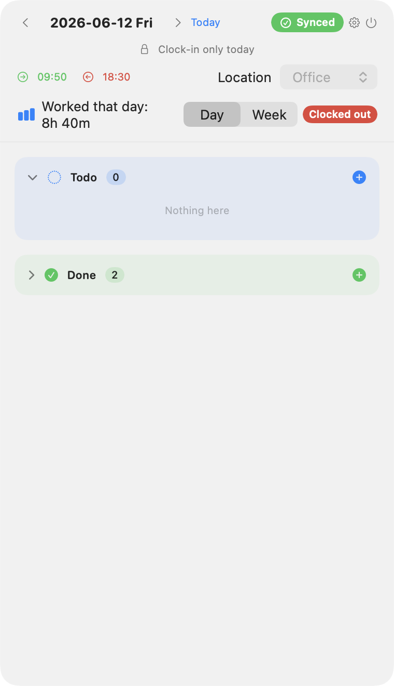
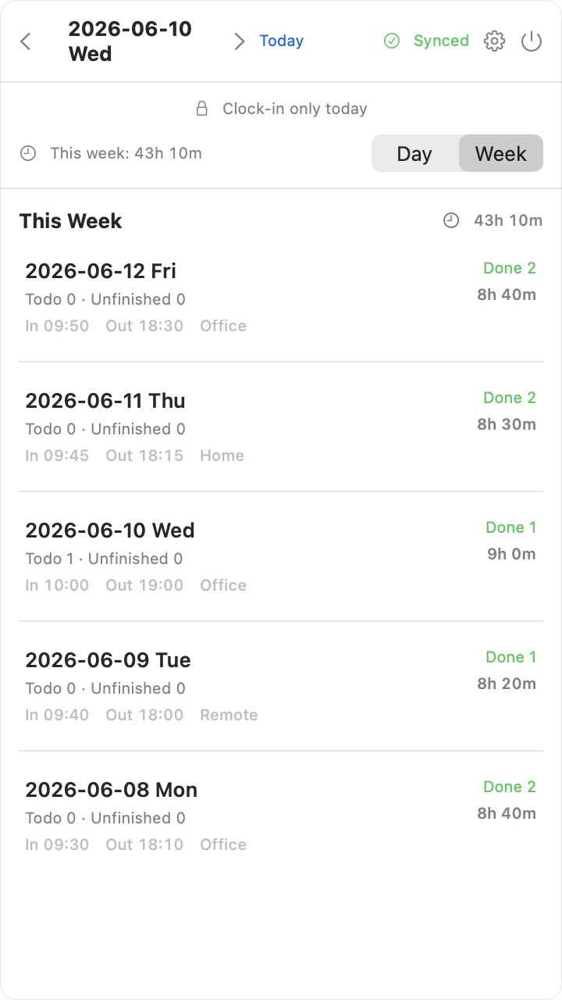
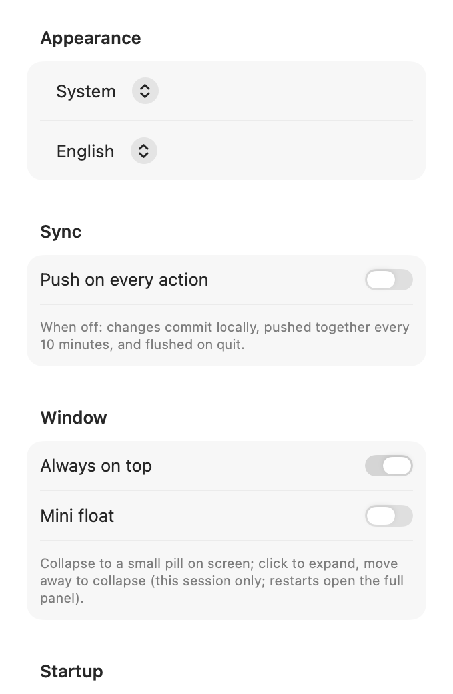

# TodoPanel

[中文](README.zh-CN.md)

A macOS menu-bar app with a floating panel for daily todo logging. It reads and writes markdown week files in your own git repository and auto-commits/pushes changes.

Clock in, manage todos, clock out — your data stays plain markdown under your control.

> **Menu-bar clock-in, markdown todos, automatic git sync — all data stays in your own repository.**

## Features

### Time tracking
- **Clock in / clock out** with work location and auto-computed duration
- **Menu-bar status**: shows live worked time while clocked in; orange icon after clock-out
- **Clock-in rules**: on the first clock-in of the day, adds scheduled tasks and moves the previous workday's follow-ups to today
- **Clock-out rules**: moves today's follow-ups to the next workday (Mon–Thu → next day; Fri → next Mon, creating the next week file if needed)

### Todo management
- **Day view**: Todo / Unfinished / Done sections with add, edit, delete, reorder, and mark-done
- **Subtasks**: toggle individually; the parent moves to Done only when every subtask is complete
- **Week view**: browse each day's clock record, todo counts, and completion stats; click a day to jump back to day view
- **Project autocomplete** from historical project names

### Automation & sync
- **Scheduled tasks** (`todo.config.json`): added on first clock-in (by weekday or month-day; weekend fixed dates defer to the next workday)
- **Weekly summary**: on Monday, auto-generates last week's summary into the repo root `README.md`
- **Git sync**: every change commits locally; pushes every 10 minutes by default, with manual sync, optional push-on-every-action, and forced push on clock-out

### UI & preferences
- **macOS-native UI**: system colors, `GroupBox` / `Form` layout, hover-reveal row actions
- **Appearance**: follow system / light / dark
- **Language**: follow system / 中文 / English (markdown section titles serialize in the current UI language)
- **Always on top**, resizable panel with content-aware height
- **Mini float** (session only): collapse to a small on-screen pill when the pointer leaves the panel; click to expand; resets to the full panel on app restart
- **Launch at login**
- **Repo path** and **config file path** overrides in Settings

## Screenshots

| Day view | Week view |
| --- | --- |
|  |  |

| Settings | Mini float |
| --- | --- |
|  |  |

Regenerate screenshots after UI changes (writes English to `docs/images/` and Chinese to `docs/images/zh/`):

```bash
swift run TodoPanel --screenshot docs/images --repo example
```

## Quick Start

### 1. Prepare a todo repository

Your todo data lives in your own git repository (with an `AGENTS.md` spec — see [example/](example/AGENTS.md)):

```
my-todo-repo/
├── AGENTS.md          # logging spec (see example/)
├── README.md          # weekly summaries are written here
├── todo.config.json   # optional: locations / scheduled tasks (see docs/CONFIG.md)
└── weeks/
    └── 2026/
        └── 2026-W32-0803-0809.md
```

### 2. Build and run

```bash
git clone git@github.com:sven0219/todo-panel.git
cd todo-panel
swift build -c release
./.build/release/TodoPanel        # run directly
./build-app.sh                     # package as TodoPanel.app (drag to Applications)
```

### 3. First launch

- If a todo repository is auto-detected near the app, it opens the main UI directly
- Otherwise a setup screen asks for the repository path (with Finder picker)
- Change the repository or config path later in **Settings** (gear icon)

## Configuration

Locations, scheduled tasks, commit message prefix, and more are configured in `todo.config.json` at the repository root; missing fields use built-in defaults. Scheduled tasks can also be managed in the Settings UI (saved back to the config file).

See [docs/CONFIG.md](docs/CONFIG.md) for the full reference.

## Troubleshooting

### “Apple could not verify ‘TodoPanel.app’ is free of malware…”

The app is built locally and ad-hoc signed, so macOS Gatekeeper may warn on first launch. If you built it yourself (or downloaded from [Releases](https://github.com/sven0219/todo-panel/releases)):

1. **Right-click → Open**, then click **Open** in the dialog (one-time).
2. Or **System Settings → Privacy & Security** → scroll to the warning → **Open Anyway**.
3. Or remove the quarantine flag:

   ```bash
   xattr -dr com.apple.quarantine /Applications/TodoPanel.app
   ```

Building from source (`./build-app.sh`) avoids downloading a quarantined binary.

## Docs

- [Configuration](docs/CONFIG.md)
- [Todo repository spec](example/AGENTS.md)
- [Example repository](example/)

## Working with AI Agents

The `AGENTS.md` in your todo repository is also an instruction file for AI coding agents (e.g. [opencode](https://opencode.ai)). An agent can follow the same rules as the app — week files, clock-in/out, follow-up transfer, weekly summary, and git commit/push — so you can switch between the GUI and an agent on the same data.

See [example/AGENTS.md](example/AGENTS.md) for the spec.

## Release

Tag a version and GitHub Actions builds and publishes automatically:

```bash
git tag v1.0.0
git push origin v1.0.0
```

## Tech Stack

- SwiftUI + AppKit (macOS 14+), Swift Package Manager, no third-party dependencies
- Markdown parse/serialize and git shell-out are built in

## Project Structure

```
├── Package.swift
├── build-app.sh            # package as .app
├── Sources/
│   ├── main.swift          # entry point (--selftest, --screenshot, --e2e)
│   ├── App/                # menu bar, panel, orchestration, config
│   ├── Models/             # data models, date helpers
│   ├── Repo/               # markdown + git
│   ├── Rules/              # clock rules, scheduled tasks, weekly summary
│   └── Views/              # SwiftUI UI
├── example/                # demo todo repository (selftest & screenshots)
├── docs/                   # documentation & screenshots
└── .github/workflows/      # release pipeline
```

## Development

```bash
swift build                              # debug build
swift build -c release                   # release binary
swift run TodoPanel --selftest --sample=example/weeks/2026/2026-W24-0608-0614.md
swift run TodoPanel --screenshot docs/images --repo example
```

`--e2e --repo <path>` runs clock-in → add → clock-out against a real repo **and commits/pushes** — use only on `example/` or a scratch branch.

## License

MIT

## Acknowledgements

This project's code was written with [opencode](https://opencode.ai) (DeepSeek V4 Flash) and [Cursor](https://cursor.com).
