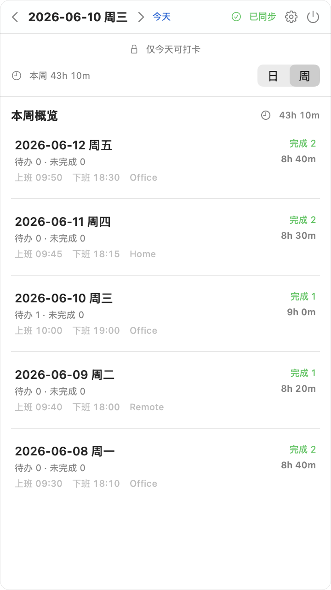
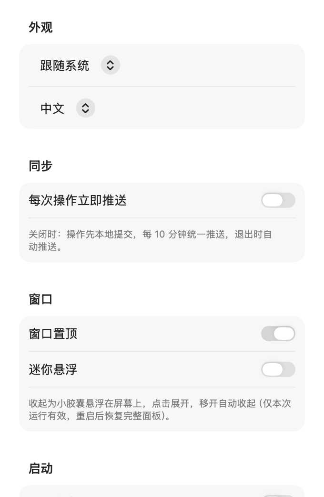

# TodoPanel

[English](README.md)

macOS 菜单栏待办客户端，通过浮动面板读写你自己 git 仓库里的 markdown 周记，并自动 commit / push。

上班打卡、管理待办、下班打卡——数据始终是纯 markdown，完全由你掌控。

> **菜单栏打卡 + markdown 待办，自动 git 同步，数据全在你自己的仓库里。**

## 功能

### 打卡与时间
- **上班 / 下班打卡**：记录办公地点，自动计算工作时长
- **菜单栏状态**：上班中显示实时工时；下班后图标变橙
- **上班规则**：当天首次打卡时添加定时任务，并将上一工作日的待跟进移到今天
- **下班规则**：将今天的待跟进移到下一工作日（周一至周四 → 次日；周五 → 下周一，必要时自动创建下周文件）

### 待办管理
- **日视图**：待办 / 今日未完成 / 已完成，支持增删改、排序、标记完成
- **子任务**：可逐项勾选；**全部**子任务完成后父项才进入「已完成」，否则留在待办
- **周视图**：浏览每天打卡记录、待办数量与完成情况；点击某天回到日视图
- **项目名自动补全**（基于历史项目）

### 自动化与同步
- **定时任务**（`todo.config.json`）：首次上班打卡时加入（按星期或每月固定日；遇周末顺延至下一工作日）
- **周总结**：每周一首次修改时，自动生成上周总结写入仓库根目录 `README.md`
- **Git 同步**：每次操作本地 commit；默认每 10 分钟批量 push，也可手动同步、每次操作立即推送，下班打卡强制推送

### 界面与偏好
- **macOS 原生 UI**：系统配色、`GroupBox` / `Form` 布局、悬停显示行操作
- **外观**：跟随系统 / 浅色 / 深色
- **语言**：跟随系统 / 中文 / English（markdown 区块标题按当前界面语言写入）
- **窗口置顶**、可调整大小、内容自适应高度
- **迷你悬浮**（仅本次运行）：鼠标移出面板后收成屏幕上的小胶囊，点击展开；重启应用后恢复完整面板
- **开机自启**
- 设置中可覆盖 **仓库路径** 与 **配置文件路径**

## 截图

| 日视图 | 周视图 |
| --- | --- |
|  |  |

| 设置 | 迷你悬浮 |
| --- | --- |
|  |  |

UI 变更后重新生成截图（会同时输出英文 `docs/images/` 与中文 `docs/images/zh/`）：

```bash
swift run TodoPanel --screenshot docs/images --repo example
```

## 快速开始

### 1. 准备 todo 仓库

数据存放在你自己的 git 仓库中（需有 `AGENTS.md` 规范，见 [example/](example/AGENTS.md)）：

```
my-todo-repo/
├── AGENTS.md          # 记录规范（见 example/）
├── README.md          # 周总结写入此处
├── todo.config.json   # 可选：地点 / 定时任务等（见 docs/CONFIG.md）
└── weeks/
    └── 2026/
        └── 2026-W32-0803-0809.md
```

### 2. 构建与运行

```bash
git clone git@github.com:sven0219/todo-panel.git
cd todo-panel
swift build -c release
./.build/release/TodoPanel        # 直接运行
./build-app.sh                     # 打包为 TodoPanel.app（拖入「应用程序」）
```

### 3. 首次启动

- 若应用附近能自动检测到 todo 仓库，直接进入主界面
- 否则会弹出设置页，要求选择仓库路径（支持 Finder 选择）
- 之后可在 **设置**（齿轮图标）中修改仓库或配置路径

## 配置

地点、定时任务、commit 消息前缀等写在仓库根目录的 `todo.config.json`；缺省字段使用内置默认值。定时任务也可在设置界面管理（会写回配置文件）。

完整说明见 [docs/CONFIG.md](docs/CONFIG.md)。

## 常见问题

### 「无法验证 TodoPanel.app 是否含有恶意软件…」

应用为本地构建并 ad-hoc 签名，首次打开时 macOS Gatekeeper 可能提示。若自行构建或从 [Releases](https://github.com/sven0219/todo-panel/releases) 下载：

1. **右键 → 打开**，在对话框中再次点 **打开**（仅需一次）
2. 或在 **系统设置 → 隐私与安全性** 中找到提示，点 **仍要打开**
3. 或在终端移除隔离标记：

   ```bash
   xattr -dr com.apple.quarantine /Applications/TodoPanel.app
   ```

从源码构建（`./build-app.sh`）可避免下载包被加上隔离属性。

## 文档

- [配置说明](docs/CONFIG.md)
- [Todo 仓库规范](example/AGENTS.md)
- [示例仓库](example/)

## 与 AI Agent 协作

仓库中的 `AGENTS.md` 也可作为 AI 编程助手（如 [opencode](https://opencode.ai)）的指令文件。Agent 可遵循与应用相同的规则——周文件、打卡、待办转移、周总结、git 提交推送——在图形界面与 Agent 之间自由切换、维护同一份数据。

规范见 [example/AGENTS.md](example/AGENTS.md)。

## 发布

打 tag 后由 GitHub Actions 自动构建并发布：

```bash
git tag v0.1.6
git push origin v0.1.6
```

## 技术栈

- SwiftUI + AppKit（macOS 14+），Swift Package Manager，无第三方依赖
- 内置 markdown 解析/序列化与 git 调用

## 项目结构

```
├── Package.swift
├── build-app.sh            # 打包 .app
├── Sources/
│   ├── main.swift          # 入口（--selftest、--screenshot、--e2e）
│   ├── App/                # 菜单栏、面板、编排、配置
│   ├── Models/             # 数据模型、日期工具
│   ├── Repo/               # markdown + git
│   ├── Rules/              # 打卡规则、定时任务、周总结
│   └── Views/              # SwiftUI 界面
├── example/                # 示例 todo 仓库（selftest 与截图）
├── docs/                   # 文档与截图
└── .github/workflows/      # 发布流水线
```

## 开发

```bash
swift build                              # 调试构建
swift build -c release                   # Release 二进制
swift run TodoPanel --selftest --sample=example/weeks/2026/2026-W24-0608-0614.md
swift run TodoPanel --screenshot docs/images --repo example
```

`--e2e --repo <path>` 会对真实仓库执行上班 → 添加 → 下班，并 **commit/push**——请仅在 `example/` 或临时分支上使用。

## 许可证

MIT

## 致谢

本项目代码由 [opencode](https://opencode.ai)（DeepSeek V4 Flash）与 [Cursor](https://cursor.com) 协助编写。
